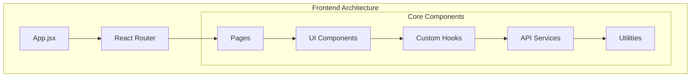
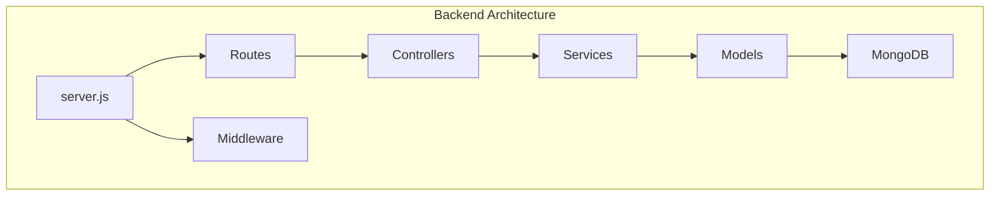
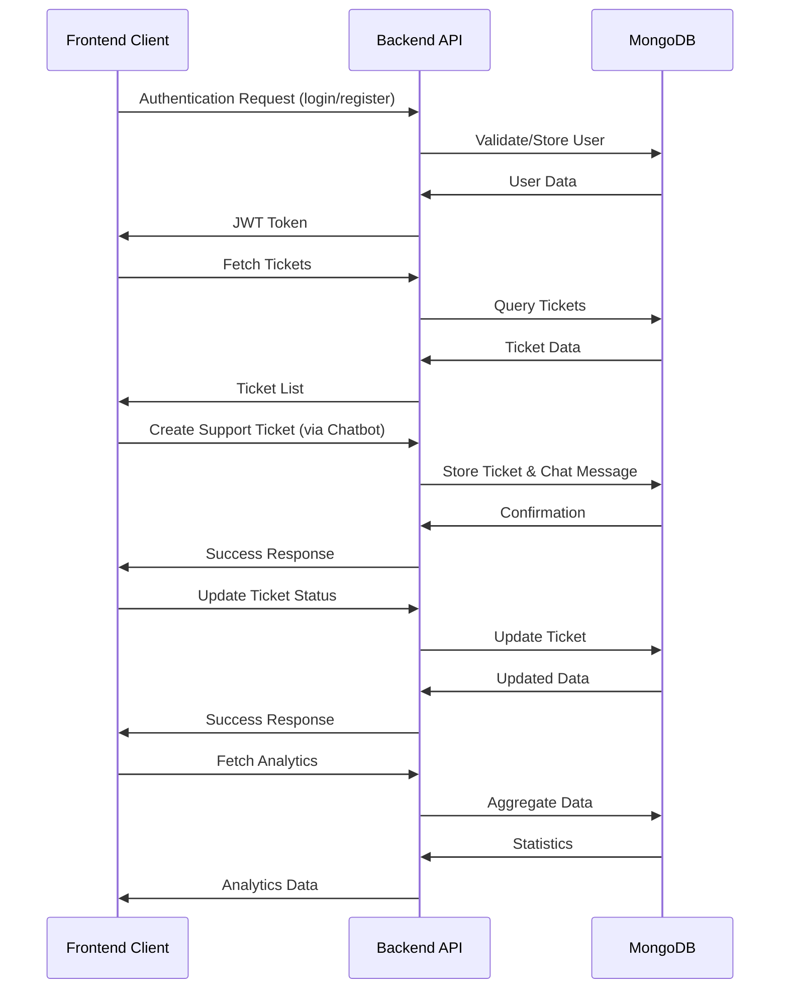

# MERN Ticketing System

This repository contains the **frontend** for a comprehensive ticketing system built with the MERN (MongoDB, Express.js, React, Node.js) stack. It provides customer support and team collaboration features including ticket management, analytics, chat integration, and more.

## Table of Contents

1. [Project Overview](#project-overview)
2. [Architecture Diagram](#architecture-diagram)
3. [Tech Stack](#tech-stack)
4. [Features](#features)
5. [Demo Credentials](#demo-credentials)
6. [Setup & Installation](#setup--installation)
   - [Prerequisites](#prerequisites)
   - [Backend Setup](#backend-setup)
   - [Frontend Setup](#frontend-setup)
7. [Environment Variables](#environment-variables)
8. [Running the Application](#running-the-application)
9. [Code Quality & Best Practices](#code-quality--best-practices)
10. [Contributing](#contributing)
11. [License](#license)

## Project Overview

The MERN Ticketing System is designed to streamline support workflows in organizations by providing:

- Public-facing landing page for information and user signup.
- Secure authentication and role-based access control (multiple admins, team members).
- Comprehensive dashboard with ticket views (All, Resolved, Unresolved).
- Advanced search and filtering for ticket management.
- Automatic ticket assignment to admins and manual reassignment to team members.
- Real-time chat support widget, with missed chat timer.
- Analytics for ticket resolution, team performance, and SLA tracking.
- Member management and profile editing.
- Mobile-responsive dummy site showcasing chatbot integration.

## Architecture Diagram

# Tickiting System Architecture

## Frontend Architecture



## Backend Architecture



## Data Flow Diagram



*A high-level diagram illustrating the flow between frontend, backend API, database, and third-party services.*

## Tech Stack

- **Frontend:** React (ES7+, Vite), React Router, CSS, Axios
- **Backend:** Node.js, Express.js, MongoDB (Mongoose), JWT authentication, Zod validation
- **Dev Tools:** ESLint, Prettier

## Features

1. **Landing Page**
   - Desktop-only public page with marketing information and signup form.

2. **Authentication**
   - User registration & login (JWT-based).
   - Role-based access: Admins & Team Members.

3. **Dashboard**
   - **All Tickets:** List of all tickets.
   - **Resolved Tickets:** Filtered view of closed tickets.
   - **Unresolved Tickets:** Filtered view of pending tickets.

4. **Ticket Management**
   - Create, view, update, delete tickets.
   - Automatic assignment to Admin by default.
   - Manual assignment to any team member.
   - Mark as Resolved / Unresolved.
   - Search and filter by status, assignee, priority, date.

5. **Team Management**
   - Invite team members.
   - Add / Remove / Update member roles and profiles.

6. **Analytics**
   - Visual reports on ticket volume, resolution times.

7. **Chat Support**
   - chat window integrated into the frontend.
   - Missed chat timer flags unattended messages.
   - Chatbot widget customization (appearance, response, prompts).
   - Demo “Hubly” dummy site with widget always visible on /dummy.

8. **Profile Editing**
   - Update name, email, password.

9. **Multi-Admin Support**
   - Separate teams and members under different admin accounts.

## Demo Credentials

| Role         | Email                | Password     |
| ------------ | -------------------- | ------------ |
| Admin        | test@example.com     | Password123  |
| Team Member  | testmember@gmail.com | Password123  |

> These credentials are for demonstration purposes only.

## Setup & Installation

### Prerequisites

- Node.js v18.x or higher
- npm or yarn
- MongoDB Atlas account (or local MongoDB)

### Backend Setup

1. Clone the repository:
   ```bash
   git clone https://github.com/Ceansyr/MERN-Ticketing-System-backend.git
   cd MERN-Ticketing-System-backend
   ```
2. Install dependencies:
   ```bash
   npm install
   ```
3. Configure environment variables:
   ```env
   MONGODB_URI=<Your MongoDB connection string>
   JWT_SECRET=<Secure JWT secret>
   PORT=5000
   ```

### Frontend Setup

1. Clone the repository:
   ```bash
   git clone https://github.com/Ceansyr/MERN-Ticketing-System-frontend.git
   cd MERN-Ticketing-System-frontend
   ```
2. Install dependencies:
   ```bash
   npm install
   ```
3. Configure environment variables:
   ```env
   VITE_API_URL=http://localhost:5000/api
   ```

## Environment Variables

**Backend (.env)**
```
MONGODB_URI=
JWT_SECRET=
PORT=5000
```
**Frontend (.env)**
```
VITE_API_URL=
```

## Running the Application

- Start backend:
  ```bash
  npm run dev
  ```
  _Server running at http://localhost:5000/_

- Start frontend:
  ```bash
  npm run dev
  ```
  _App running at http://localhost:5173/_


## Code Quality & Best Practices

- **ESLint & Prettier** for consistent formatting
- **Zod** for request validation
- **Centralized Error Handling** in Express

## License

Licensed under the MIT License. Check the LICENSE file for details.

